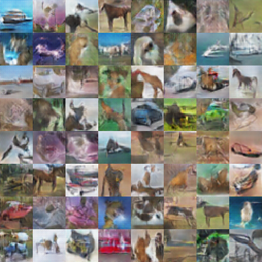
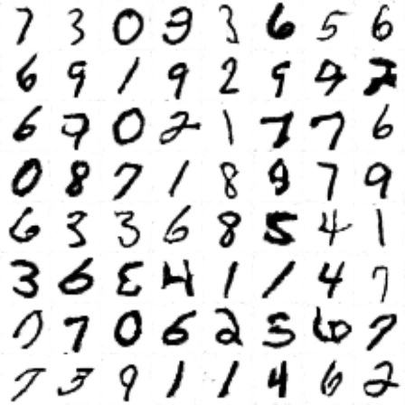

# chainer-LSGAN
An implementation of the [Least Squares Generative Adversarial Network](https://arxiv.org/abs/1611.04076) architecture using the [Chainer framework](http://chainer.org/). 

## CIFAR10 & MNIST for 100 epochs
<p align="center">
   
</p>

## Usage
Trains on the MNIST dataset, and will generate an image of a sample batch from the network after each epoch. Run the following:
```
python train.py --device_id 0
```
to train. By default, an output folder will be created in your current working directory. Setting `--device_id` to -1 will run in CPU mode, whereas 0 will run on GPU number 0 etc. 

